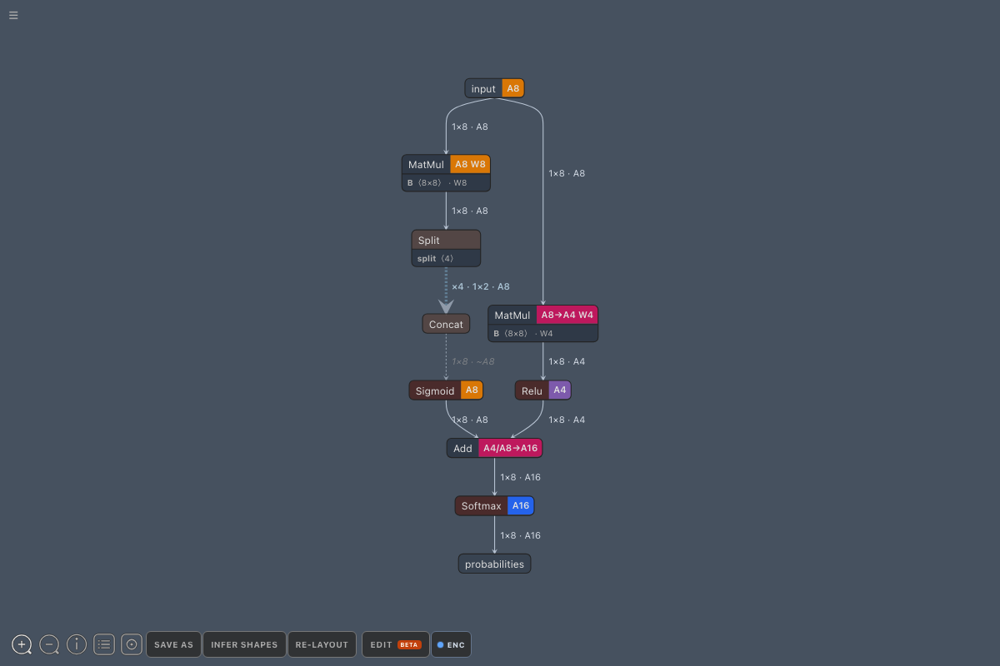
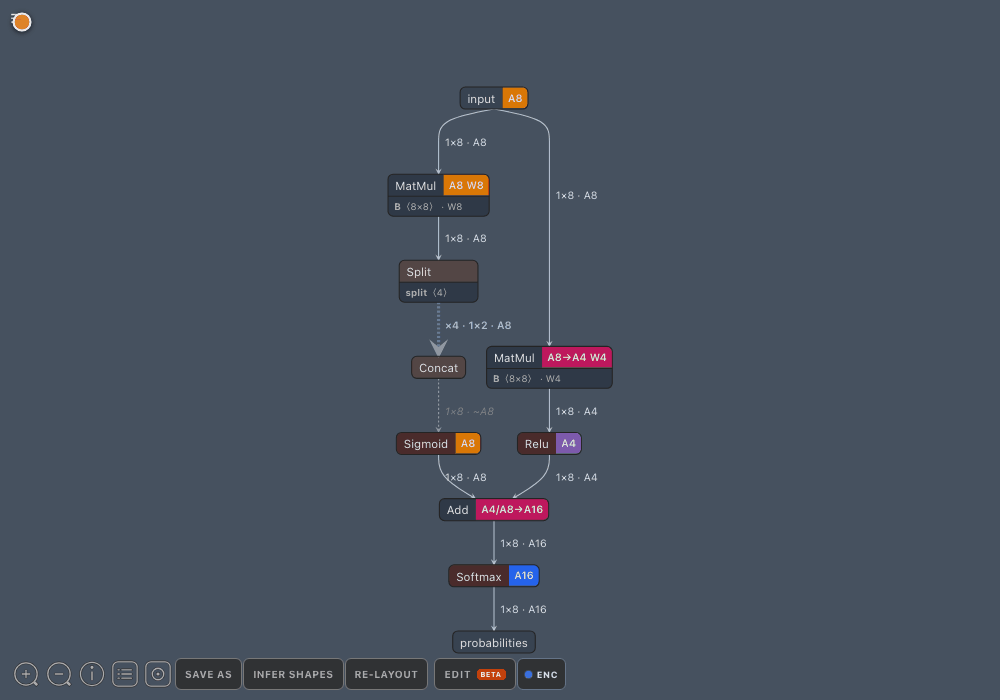

# HNNX

HNNX is an ONNX graph workbench for model inspection, AIMET quantization
analysis, and NVIDIA ONNX GraphSurgeon-backed editing.


**Downloads:** [HNNX releases](https://github.com/hyukize/HNNX/releases) · [Source repository](https://github.com/hyukize/HNNX)

## Why HNNX

- Explore ONNX graphs with Netron's mature visualization engine
- Load AIMET encodings and inspect activation, parameter, and mixed precision
- Trace activation precision through encoding-free operations
- Edit connections, endpoints, and common Opset 17 nodes
- Validate unsaved edits with ONNX shape inference before Save As
- Work locally or from VS Code Remote, Dev Container, and Kubernetes sessions
- Use native macOS, Windows, and Linux packages or the VS Code extension



<details>
<summary>Connection editing demo</summary>



</details>

## Get started

1. Choose a package from the [installation guide](docs/installation.md).
2. Open an `.onnx` model.
3. Optionally attach its AIMET encodings file.
4. Create the recommended GraphSurgeon environment before editing or running
   shape inference.

The complete first-run walkthrough is in
**[Getting Started](docs/getting-started.md)**.

## Documentation

| Guide | English | 한국어 |
| --- | --- | --- |
| Getting Started | [Open](docs/getting-started.md) | [열기](docs/ko-kr/getting-started.md) |
| Installation | [Open](docs/installation.md) | [열기](docs/ko-kr/installation.md) |
| Graph Editing | [Open](docs/graph-editing.md) | [열기](docs/ko-kr/graph-editing.md) |
| AIMET Encodings | [Open](docs/aimet-encodings.md) | [열기](docs/ko-kr/aimet-encodings.md) |
| Troubleshooting | [Open](docs/troubleshooting.md) | [열기](docs/ko-kr/troubleshooting.md) |

Additional references: [complete feature reference](docs/feature-reference.md) ·
[development and test documentation](docs/development/)

## Quick development setup

```bash
git clone https://github.com/hyukize/HNNX.git
cd hnnx
npm install
npm start
```

`npm install` does not install Python packages. Graph editing and shape
inference use a dedicated environment described in
[Graph Editing](docs/graph-editing.md#graphsurgeon-environment).

## Showcase model

Open these two files together for the compact mixed-precision example shown
above:

- `examples/hnnx-mixed-precision.onnx`
- `examples/hnnx-mixed-precision.encodings`

The graph contains A4/A8 branches, W4/W8 parameters, an `A4/A8→A16` merge,
an A16 output, and a four-way Split-to-Concat bundle.

## Attribution

HNNX is derived from [Netron](https://github.com/lutzroeder/netron) and retains
Netron's MIT license and copyright notice. HNNX-specific modifications are by
Jonghyuk Park. See [LICENSE](LICENSE).
